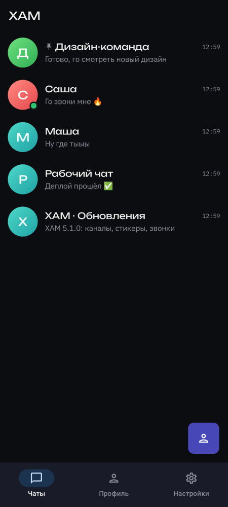
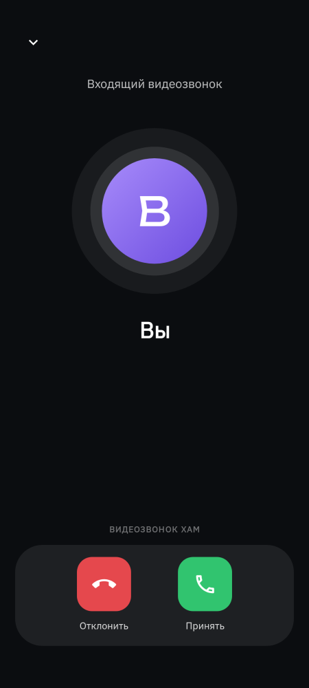
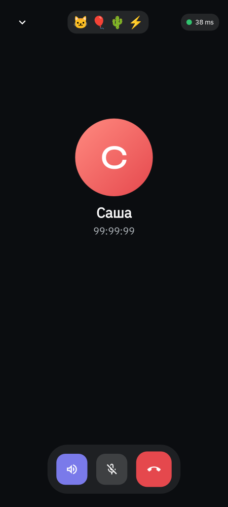
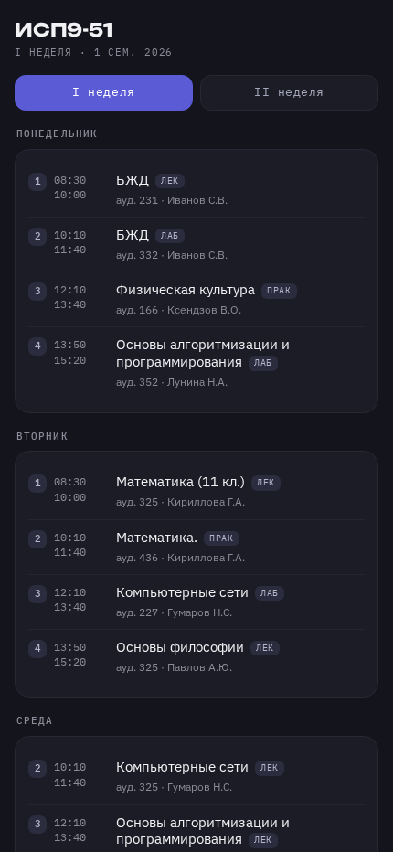

<h1 align="center">Egor Dorohov</h1>

  <b>Full-stack vibe-coder</b> · real-time services, Telegram apps, self-hosted infrastructure

  
  

---

### About

I build things end to end: backend, client, and the server they run on.
Most of my projects are real-time — WebSocket game rooms, chat, voice calls — and
they live on my own VPS: nginx, Docker, PostgreSQL, Redis, TLS, deploys, logs and
outages included.

I like problems where the fix is found in a log file and proven with a measurement,
not guessed.

### Stack

**Languages** &nbsp;

**Backend** &nbsp;

**Clients** &nbsp;

**Infrastructure** &nbsp;

### Selected work

**[durak](https://github.com/egordorohov/durak)** — multiplayer card game (Telegram Mini App)
> FastAPI + WebSocket rooms, PostgreSQL and Redis, bot opponents that fill empty seats,
> ranks and cosmetics. Runs in production on my own server behind nginx.

**[delivery](https://github.com/egordorohov/delivery)** — storefront and checkout prototype
> Static front-end: catalog, cart, order flow. No framework, just HTML, CSS and JavaScript.

### In private

**A messenger, built solo, top to bottom** — private for now, but there's a lot in it.

  
  
  
  

- **End-to-end encryption** — one identity keypair per account (not per device), device
  linking and key transfer done over QR, so a new device joins an encrypted conversation
  instead of starting a blank one.
- **Voice channels, Discord-style** — mesh WebRTC, screen share, a live speaking-now
  indicator, a shared drawing board, and small multiplayer games (blackjack, poker,
  Wordle) playable right inside the call.
- **Calls that survive bad networks** — WebRTC tuning based on real device measurements
  rather than defaults, a TURN relay of my own, and an in-app VPN tab (Xray-core) for
  when the network itself is the problem.
- **Four clients, one account** — Android (Kotlin/Compose), a web client, and a desktop
  app (Tauri) with self-updating builds, all talking to the same backend and the same
  end-to-end keys.
- **Mail on my own domain** — inbound SMTP wired straight into the chat: pick a mailbox
  name in a bot conversation, and mail to it shows up as a message, HTML and
  attachments included.
- **Bots and Mini Apps** — a Telegram-style bot platform (webhooks, inline keyboards,
  scoped tokens) hosting a schedule bot, a card game, and a couple of in-house tools.
- **A Telegram gift-number sniping bot** — one monolithic Python file (thousands of
  lines, everything handled by hand: multi-account management, scheduled jobs,
  monitoring, an admin panel) that watches Telegram's collectible gifts and grabs
  ones with a good number the moment they're mintable — think `PlushPepe-67`. Caught
  around 20 of them so far, worth roughly 5000 TON.

### Activity

  
  
  

